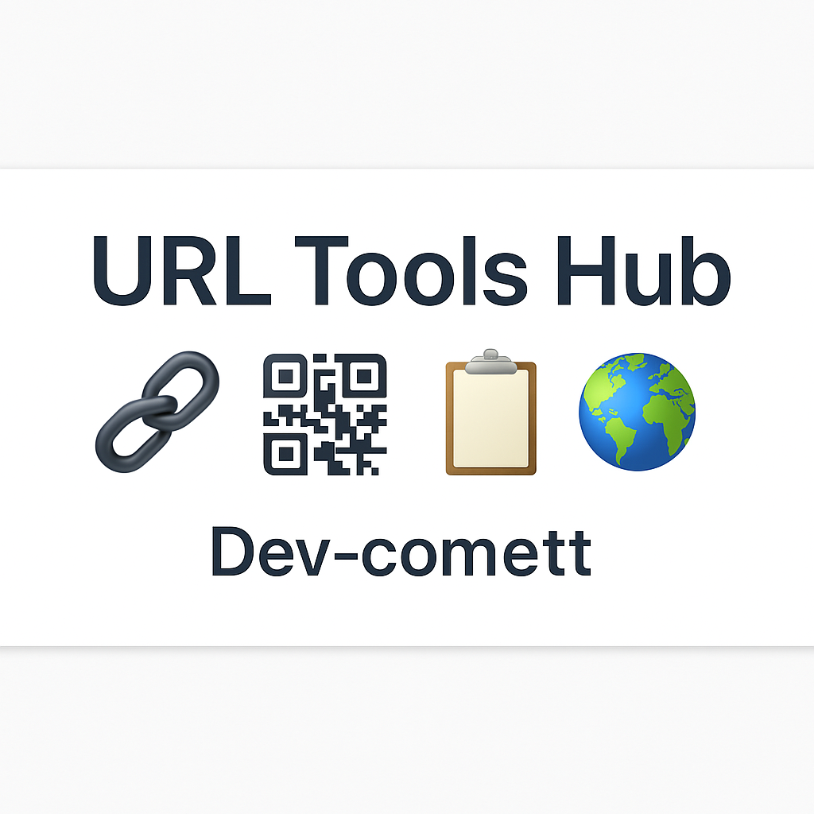

<p align="center">
  
</p>

<p align="center">
  <a href="https://www.python.org/"></a>
  <a href="https://streamlit.io/"></a>
  <a href="https://github.com/Dev-comett/URL-Short/blob/main/LICENSE"></a>
  <a href="https://tinyurl.com/2xjo2ckz"></a>
</p>


# 🔗 URL Tools Hub

A powerful and beautifully interactive **Streamlit web app** for URL shortening and more. It offers:
- 🔗 TinyURL-based link shortening  
- 📱 QR Code generation  
- 📋 Copy-to-clipboard support  
- 🌐 Custom domain shortener (e.g., `dev.ly/xyz`)  
- 📊 Analytics dashboard with history tracking  

> ✨ Code beautified and enhanced by [ChatGPT](https://openai.com/chatgpt)

---

## 🚀 Live Demo

👉 [Try the App on Streamlit](https://tinyurl.com/2xjo2ckz)

---

## 🧰 Tech Stack

| Layer           | Tech               |
|----------------|--------------------|
| Frontend       | Streamlit          |
| Shortening API | pyshorteners       |
| QR Code        | qrcode             |
| Analytics      | pandas + session   |
| Styling        | HTML/CSS via Streamlit widgets |

---

## 📸 Features

### 🔗 URL Shortening
- Uses `pyshorteners` with TinyURL API
- Clean UI with one-click generation

### 📱 QR Code Generator
- Instantly generates scannable QR codes from any URL

### 📋 Copy to Clipboard
- Click to copy short URLs using HTML/JS embedded in Streamlit

### 🌐 Custom Domain Shortener
- Create mock short links like `dev.ly/mycustomlink`

### 📊 Analytics Dashboard
- Tracks:
  - Original & shortened URLs
  - Usage count
  - Timestamp
  - Shortener type

---

## 🧠 How It Works

- Built using Streamlit's sidebar-based navigation  
- Each feature is modular and user-driven  
- Session-based storage using `st.session_state`  
- Simple, single-file deployment (ideal for rapid prototyping)

---

## 📦 Setup Locally

1. **Clone the repo**
```bash
git clone https://github.com/Dev-comett/URL-Short.git
cd URL-Short
